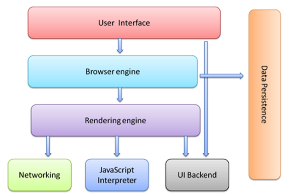

# 认识 Web 和 Web 标准

## Web、网页、浏览器

### Web

Web（World Wide Web）即是全球广宇网，也称为万维网

### 网页

**网页是构建网站的基本元素**。

### 浏览器

浏览器是网页运行的平台

## Web 标准

### W3C 组织

W3C：1994 年成立的万维网联盟组织，用来指定 web 标准的机构。

### Web 标准

制作网页要遵循的规范。

#### Web 标准包括三个方面：

- HTML（HyperText Markup Language）：结构标准，超文本标记语言，用于对网页元素进行整理和分类。
- CSS（Cascading Style Sheets）：表现标准，层叠样式表，用于设置网页元素的板式、颜色等外观样式。
- JS（JavaScript）：行为标准，用于定义网页的交互和行为。

# 浏览器的介绍

## 浏览器的组成

1. 渲染引擎（浏览器内核）
2. JS 引擎

### 渲染引擎

浏览器所采用的**渲染引擎**也称之为**浏览器内核**，用来解析 HTML 与 CSS。渲染引擎决定了浏览器如何显示网页的内容以及页面的格式信息。

常见的浏览器内核如下：

|     浏览器     |  内核   |
| :------------: | :-----: |
|     chrome     |  Blink  |
|      欧鹏      |  Blink  |
| 360 安全浏览器 |  Blink  |
| 360 极速浏览器 |  Blink  |
|     Safari     | Webkit  |
|    FireFox     |  Gecko  |
|       IE       | Trident |

### JS 引擎

也称为 JS 解析器。

常见浏览器的 JS 引擎如下：

|    浏览器    |                                     JS 引擎                                     |
| :----------: | :-----------------------------------------------------------------------------: |
| chrome、欧鹏 |                                       V8                                        |
|    Safari    |                                      Nitro                                      |
|   FireFox    |      SpiderMonkey（1.0-3.0）/ TraceMonkey（3.5-3.6）/ JaegerMonkey（4.0-）      |
|    Opera     | Linear A（4.0-6.1）/ Linear B（7.0-9.2）/ Futhark（9.5-10.2）/ Carakan（10.5-） |
|      IE      |                                     Trident                                     |

## 浏览器工作原理

1. User Interface 用户界面，我们所看到的浏览器
2. Browser engine 浏览器引擎，用来查询和操作渲染引擎
3. Rendering engin 渲染引擎，用来显示请求的内容，负责解析 HTML、CSS
4. Networking 网络，负责发送网络请求
5. JavaScript Interpreter（解析者）JavaScript 解析器，负责执行 JavaScript 的代码
6. UI Backend UI 后端，用来绘制类似组合框和弹出窗口
7. Data Persistence（持久化）数据持久化，数据存储 cookie、HTML5 中的 SessionStorage
